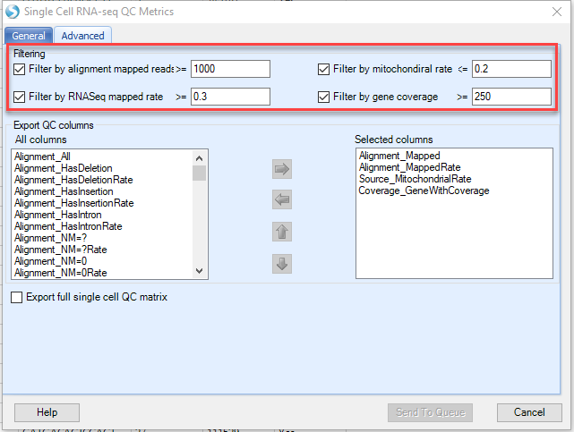

## Quality control on the cells

Single Cell alignment/quantification will result in hundreds/thousands of cells, during which there will be various qualities for different cells. Low-quality cells need to be removed to ensure that technical effects do not distort downstream analysis results. We would like to propose this criteria for filtering low quality cells, with which we have been used for curating our data for SingleCell lands:

  -	Mapped rate:     >=40% for **human**; >=30% for **mouse**

  -	Mapped reads:     >=50,000 for Non **UMI**; >= 1000 for **UMI**

  - Gene coverage:     >=1000 for Non **UMI**; >=250 for **UMI**

  -	Mitochondrial rate: < 20%

  -	Spike-in RNA rate (if there is Spike-in and calculated): < 20%

Based on this criterion, we consider the cells with small number of mapped reads have low quality, as well as the alignment mapped rate. The minimal gene coverage is defined as the number of genes with non-zero counts for that cell, and we set the threshold as 1000 for reads containing UMI, 50,000 for reads don’t have UMI. Any cells with very few expressed genes are considered with poor quality, probably due to the failure of capturing the diverse transcript population.  

Besides that, we also measure the proportion of reads mapped to genes in the mitochondrial genome. High proportion of reads mapped to mitochondrial might be an indication of increased apoptosis and/or loss of cytoplasmic RNA from lysed cells. Similar consideration applies to the ratio of genes mapped to Spike-in RNA. If the portion mapped to spike-in RNA is high, these cells might have lost the major portion of endogenous RNA, thus considered as low quality. If there is no spike-in RNA included in the sample, then this part can be removed from the criteria.

## scRNA-Seq QC Metrics:

ArrayStudio has provided a module to do Alignment data QC especially designed for Single Cell RNA-seq, which can be accessed by going to NGS | Single Cell RNA-seq | SC RNA-seq QC Metrics:

This module takes bam file resulted from barcoded alignment as input file, user can click **Add** to import the formally aligned bam files, and choose the corresponding genome and gene model used for the alignment, and input the output folder to run the job:

To reduce the file size, OmicSoft has added features to this module to output only the results desired by the user. In the Advanced Tab:

By default, OmicSoft will report the four main criteria used to QC cells in OmicSoft Lands that are outlined above. If users would like to report additional QC summary statistics, this can be done by moving from the All columns (left pane) to the selected columns (right pane) with the arrows.

When the job finishes, an SC RNA Seq QC Metrics Table will be generated. Different from the RNASeq QC metrics report for bulk RNASeq, this SC RNA Seq QC Metrics Table will have the cell name as the row ID, and different alignment statistics as the column name. In addition, only the metrics specified in the advanced tab will be specified:

User can filter for these columns for the quality control accordingly:

  - Mapped rate – **Alignment_MappedRate**: >=40% for **human**; >=30% for **mouse**

  -	Mapped reads – **Alignment_Mapped**: >=50,000 for **Non UMI**; >= 1000 for **UMI**

  -	Gene coverage – **Coverage_GeneWithCoverage**: >=1000 for **Non UMI**; >=250 for **UMI**

  -	Mitochondrial rate – **Source_MitochondrialRate**: < 20%
