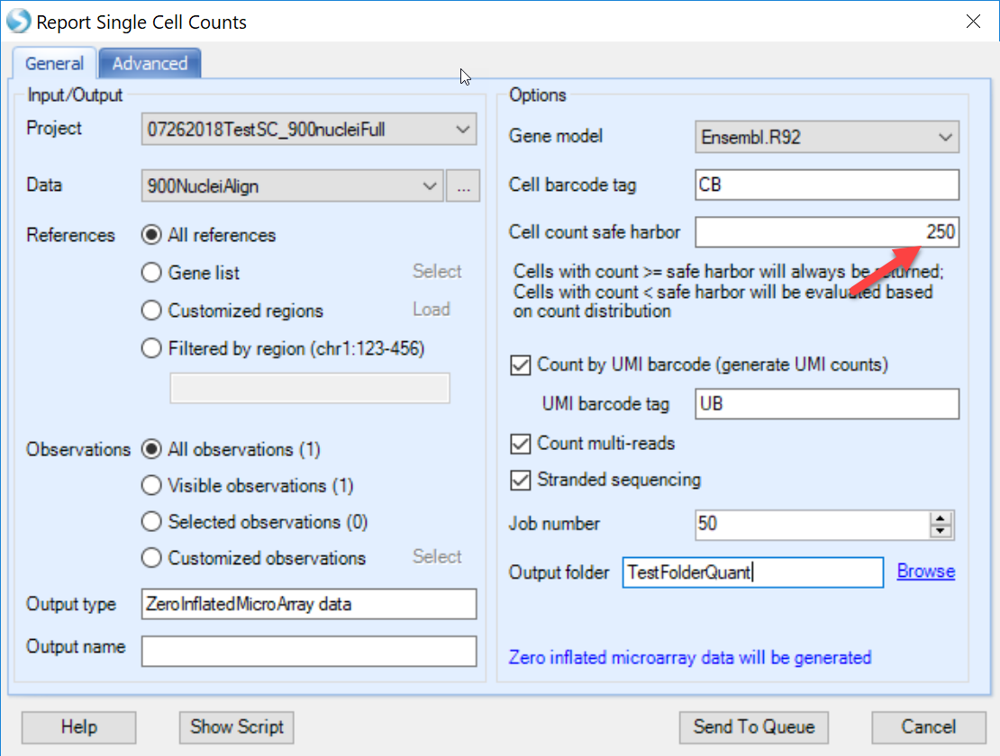

# scRNA-Seq Quantification

ArrayStudio provides modules and options for scRNA-Seq quantification.

## Report Barcoded BAM Counts

For single cell sequencing data analysis, one of the most important parts is to get the transcript count for each cell, and this module in ArrayStudio can be accessed by going to Analysis | NGS | Single Cell RNA-Seq | Barcoded BAM Based Counting:

This module will quantify unique UMI counts for each gene from the BAM files. Optionally, if the user would like to completely remove the duplicates from the BAM file, they can use the Remove Duplicates function [here](./AdditionalOptions.md)

This window will be similar to the normal RNASeq quantification, user can leave all the settings on the left as default. For the Options on the right section, **Gene model** and **Cell barcode tag** will be automatically assigned based on the bam file information; User can modify the setting for **Cell count safe harbor** - this parameter will filter for cells that have at least the specified number of genes represented. For UMI studies, as shown for the [AlignQC](./QC of Aligned Data.md) step, we recommend using 250 as a safe harbor.  

Leave settings as default and specify **Job Number** as the number of processes to run in parallel. Specify the output folder where the results files will be saved, otherwise the files will go the project folder by default.

On the Advanced tab, there are three additional options for UMI counting:

**Cluster UMI** - Similar to barcode correction performed during pre-processing, sequencing errors in the UMI tags can be corrected using this option. For more details on clustering UMI reads, please see the wiki page here: http://www.arrayserver.com/wiki/index.php?title=Ngs_ReportSingleCellCounts.pdf#Cluster_UMI

For both datasets provided for Tutorials by OmicSoft, Cluster UMI can be used.

**Convert UMI count to transcript number** is an option we designed for the correction of “UMI saturation”, please refer to our wiki: [UMI to Transcript](http://www.arrayserver.com/wiki/index.php?title=Ngs_ReportSingleCellCounts.pdf#Convert_UMI_count_to_transcript_number) for the detailed explanation. This option is not needed for the 10X dataset analyzed in these tutorials, as they use 10 bp for the UMI tag. However, for the [CEL-Seq experiment](./Pre-processing/non10XData.md), the UMI tag is only 4 nucleotides long, leading to possible saturation. In this case, users can use this option to convert UMI counts to account for this saturation.

**RPM Scaling** - this option allows users to normalize cell counts as part of the quantification step (to reads per million). By checking this option, users skip this further processing that is described [here](./Downstream Analyses of SC Data.md#Normalization). Please note if running a server project, this step requires ArrayServer version 10.0.1.96 or newer.

Once the appropriate options are chosen, click **Send To Queue** to submit the job.

## Output files and tables

When the job is done, there will be an -Omic Data object (a zero inflated binary matrix, or ZIM, data object), with a counts table representing all kept cells as columns and all genes as rows.

 If the user chooses to convert UMI counts to transcript number, there will be two -Omic data objects: a zero inflated binary matrix (ZIM) data object to store the UMI count, and another MicroArray type data object to store the converted UMI count:

This is the ZIM data object file which has 256 as the maximum UMI count:

And this will be the normal MicroArray type -Omic data which store the converted theoretical UMI count, which has the maximum UMI as 1420:

If the user chooses to normalize UMI counts to reads per million, an addtional -Omic data object will be generated with each cell normalized to one million counts:

