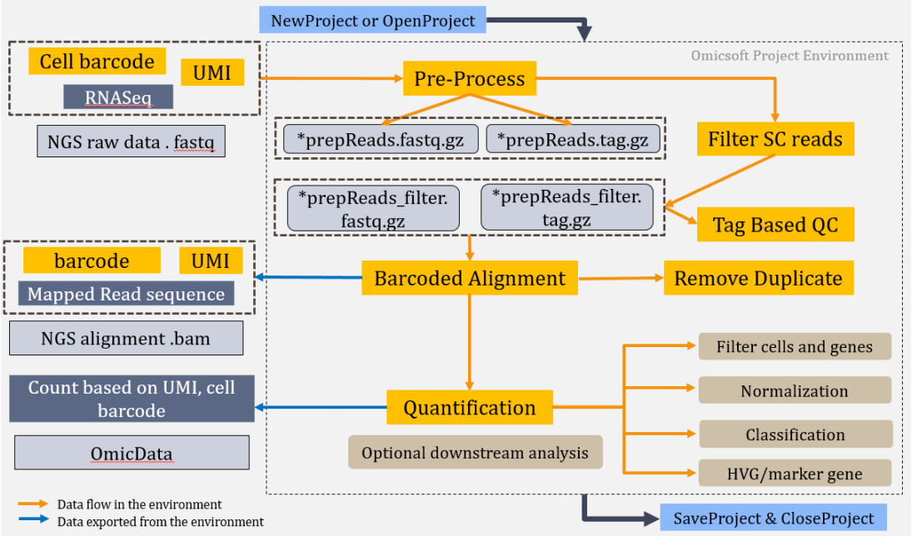

# Single Cell RNASeq Analysis Workflow

In this tutorial, we will introduce the SCRNA-Seq data analysis workflow in ArrayStudio, step by step. The workflow consists of a number of modules for SCRNA-Seq data processing, including pre-process, filter SC reads, Tag Based QC, alignment, quantification, and a series of optional downstream analysis, as shown in the schematic chart below:

